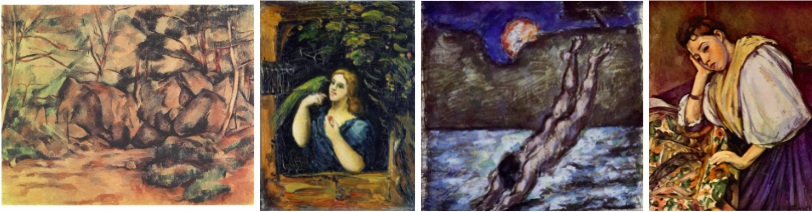
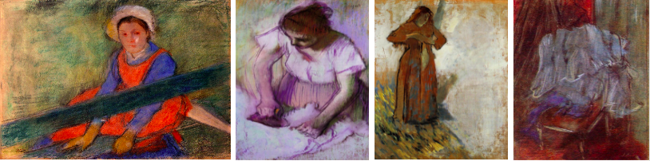
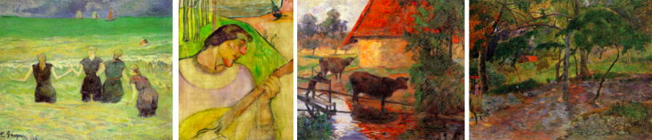
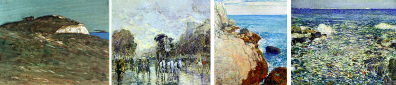
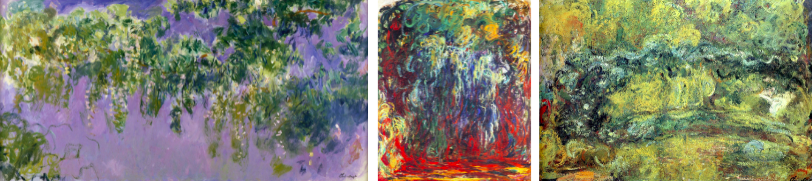

# Reproducion-CAN

### Table of Contents
**[Dataset](#dataset)**<br>
**[Workflow](#workflow)**<br>
**[Limitaciones](#limitaciones)**<br>


## Dataset

[WikiArt](https://www.wikiart.org/es) es una enciclopedia de arte visual, el cual se utilizó para fines de extracción de datos utilizando el conjunto de datos en [Kaggle](https://www.kaggle.com/delayedkarma/impressionist-classifier-data) el cual posee una colección de obras impresionistas de 5 artistas diferentes el cual forma parte de WikiArt, conformando un total de 2490 obras de arte.

### Cezanne


### Degas


### Gauguin


### Hassam


### Monet


## Workflow

Instalar requerimientos a travez del siguiente comando:

```
pip install -r requirements.txt
```

Cambiar el directorio para las siguientes variables:dentro de CAN y DCGAN

* data: conjuto de datos a entrenar
* sample_dir: directorio vacio donde se guardaran las imagenes creadas por el generador
* checkpoint_dir
* logs

Tambien agregar las clases que utilizara el dataset en `label_dict`

Por ultimo ejecutar el archivo `main.py`

## Limitaciones

Crear un entorno virtual con las versiones de python 3.6 y tensorflow  1.